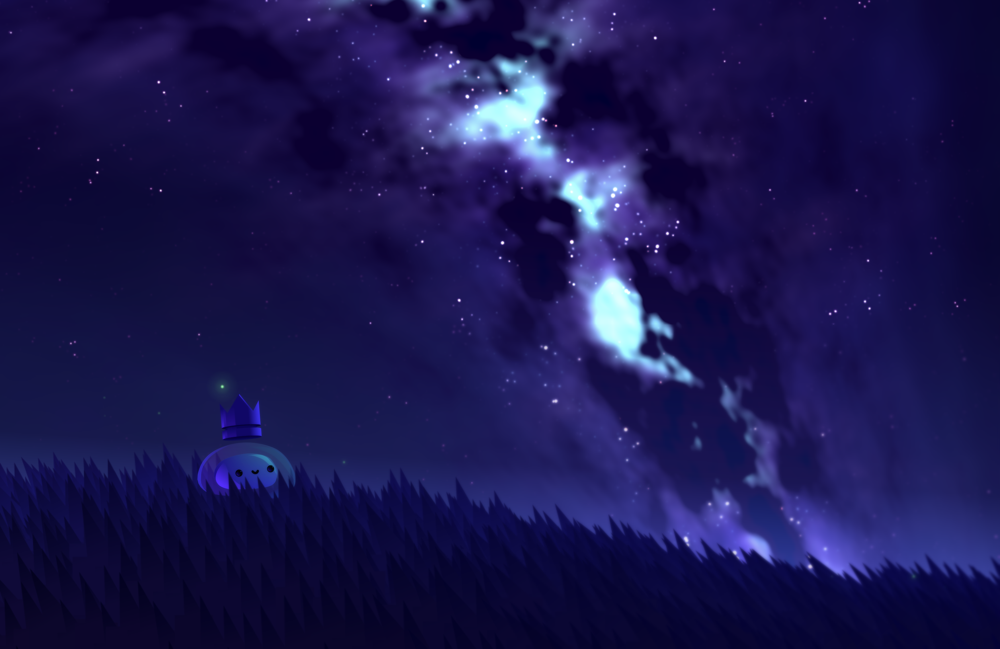

*A light breeze* 
*brings a midnight chill.* 
*A sea of stars above* 
*a grassy hill.* 
*Who needs more than that?* 

— 👑

<h1 align="center">Yallpaper</h1>

Yallpaper is a simple, open-source app to have an animated wallpaper on MacOS. It's something I made for y'all!

## Technologies

- Swift app running built-in WebKit
- High-performance WebGPU/HTML/TS

## Requirements
- XCode ([Install](https://developer.apple.com/xcode/))
- NodeJS/NPM ([Install](https://docs.npmjs.com/downloading-and-installing-node-js-and-npm))

## Development

### Web (`./www`)

To set up, run `npm i` to install the required packages.

To run locally via your favorite web browser, run `npm run dev` in the command line, and go to the directed address.

Once you've made the changes you like, run the `build` script in the root of this repository. This will call `npm run build` on `www`, take the extracted files, and move them to the `Resources` location in the `Yallpaper` app.

### App (`./app`)

To set up, open in XCode.

To run, simply click the <kbd>▶</kbd> icon in the top left. To stop, simply click the <kbd>◽️</kbd> icon in the top left. More information about XCode usage can be found [here](https://developer.apple.com/documentation/xcode).
